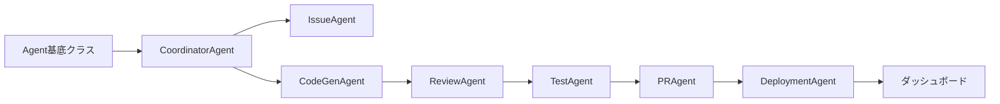

# Miyabi Framework - 本格実装計画

## 📋 実装ステップ

### Phase 1: コア基盤（1週間）
- [ ] Agent基底クラス設計
- [ ] DAGタスクエンジン実装
- [ ] イベントバス・メッセージキュー
- [ ] エラーハンドリング・リトライ機構

### Phase 2: 7つのAgent実装（2週間）
1. **CoordinatorAgent**
   - [ ] タスク分解アルゴリズム（DAG生成）
   - [ ] Critical Path分析
   - [ ] 並列実行スケジューラー
   
2. **IssueAgent**
   - [ ] 65ラベル分類器（ML or ルールベース）
   - [ ] 複雑度推定ロジック
   - [ ] 優先度スコアリング
   
3. **CodeGenAgent**
   - [ ] Claude API統合
   - [ ] コンテキスト管理（既存コード理解）
   - [ ] テンプレートエンジン
   
4. **ReviewAgent**
   - [ ] 静的解析ツール統合（ESLint, TSC）
   - [ ] セキュリティスキャナー
   - [ ] 品質メトリクス計算
   
5. **PRAgent**
   - [ ] GitHub API統合
   - [ ] Conventional Commits生成
   - [ ] チェンジログ自動生成
   
6. **DeploymentAgent**
   - [ ] CI/CDパイプライン
   - [ ] ヘルスチェック実装
   - [ ] ロールバック機構
   
7. **TestAgent**
   - [ ] テスト生成ロジック
   - [ ] カバレッジ計測
   - [ ] E2Eテスト自動化

### Phase 3: インテグレーション（1週間）
- [ ] GitHub Webhooks設定
- [ ] Slack/Discord通知
- [ ] ダッシュボードAPI
- [ ] モニタリング・ログ収集

### Phase 4: データ層（3日）
- [ ] PostgreSQL/MongoDB設計
- [ ] Prisma/TypeORM設定
- [ ] キャッシュ層（Redis）
- [ ] ベクトルDB（埋め込み用）

## 🛠 技術スタック

```yaml
Backend:
  - Node.js + TypeScript
  - Express/Fastify
  - BullMQ（ジョブキュー）
  - Prisma（ORM）

AI/ML:
  - Claude API（コード生成）
  - OpenAI Embeddings（類似検索）
  - Langchain（エージェント制御）

Infrastructure:
  - Docker + Kubernetes
  - GitHub Actions
  - AWS/GCP/Vercel

Monitoring:
  - Prometheus + Grafana
  - Sentry（エラートラッキング）
  - DataDog（APM）
```

## 📁 プロジェクト構造

```
miyabi/
├── packages/
│   ├── core/              # コアエンジン
│   ├── agents/             # 各Agent実装
│   ├── integrations/       # 外部API統合
│   └── dashboard/          # 管理画面
├── apps/
│   ├── api/                # REST/GraphQL API
│   ├── worker/             # バックグラウンドジョブ
│   └── webhook/            # Webhookハンドラー
├── infrastructure/
│   ├── docker/
│   ├── k8s/
│   └── terraform/
└── tests/
    ├── unit/
    ├── integration/
    └── e2e/
```

## 🔑 必要な環境変数

```env
# AI APIs
ANTHROPIC_API_KEY=
OPENAI_API_KEY=

# GitHub
GITHUB_TOKEN=
GITHUB_WEBHOOK_SECRET=

# Database
DATABASE_URL=
REDIS_URL=

# Monitoring
SENTRY_DSN=
DATADOG_API_KEY=

# Notifications
SLACK_TOKEN=
DISCORD_WEBHOOK_URL=
```

## 📊 成功指標（KPI）

1. **自動化率**: 80%以上のタスクを自動処理
2. **処理時間**: Issue作成から実装完了まで30分以内
3. **品質スコア**: 全コード80点以上
4. **テストカバレッジ**: 80%以上維持
5. **エラー率**: 1%未満

## 🚦 実装順序



## 💰 コスト見積もり

- Claude API: ~$500/月（1000タスク想定）
- GitHub Actions: ~$50/月
- インフラ（AWS/GCP）: ~$200/月
- **合計: ~$750/月**

## 🎯 マイルストーン

- **Week 1**: コア基盤完成、CoordinatorAgent動作確認
- **Week 2**: 3つのAgent（Issue, CodeGen, Review）統合
- **Week 3**: 全Agent統合、E2Eテスト
- **Week 4**: ダッシュボード完成、本番デプロイ

## 次のステップ

1. まずAgent基底クラスを実装
2. CoordinatorAgentでタスク分解をテスト
3. CodeGenAgentでClaude API統合
4. GitHub Actionsでパイプライン構築

準備OK？始めようか！